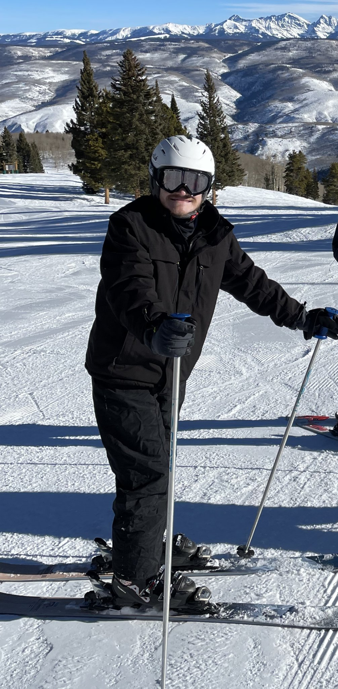
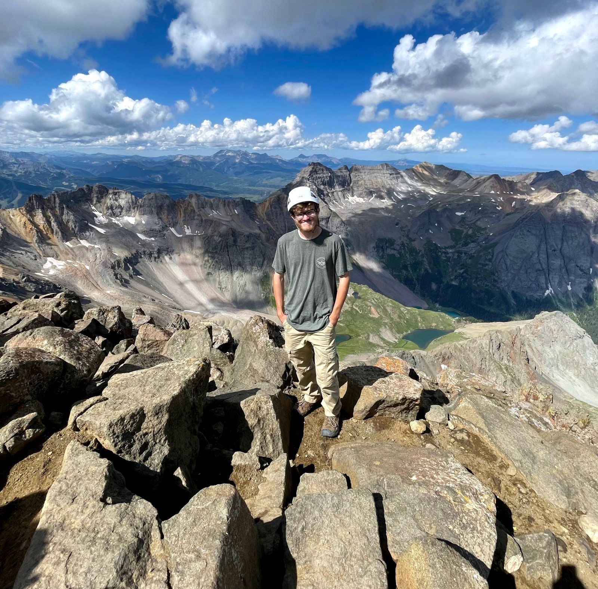
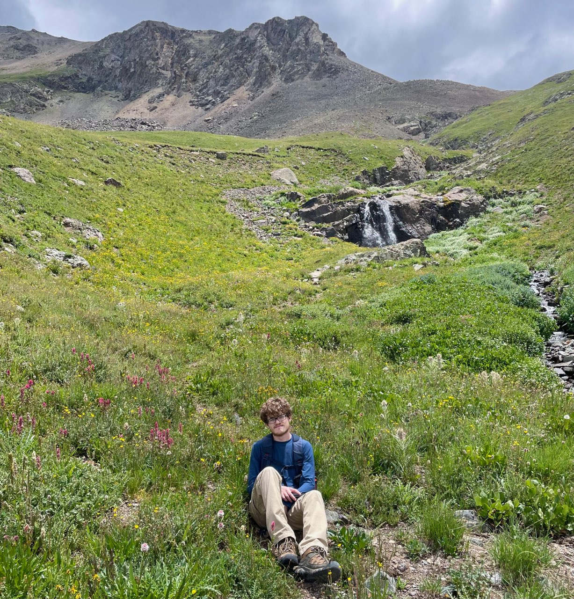

+++
title = "About Me"
description = "lorem ipsum about sit amet"
template = "page.html"
slug = "about"
draft = false

#[taxonomies]
#    categories = ["about"]
#    tags = []

[extra]
    page_identifier = "about"
+++

<!-- more -->

Hi! I'm Carson, and I make stuff.

I'm currently a third-year Electrical and Computer Engineering student at Carnegie Mellon.
When I'm not in classes, I like to tinker with hardware and software projects, and occasionally play games.
You can find more detail on some of the things I've made on the [Projects Page](@/projects/_index.md).

### A few pictures

I'm from Colorado,
and whenever I'm back there I enjoy going outside for some air that doesn't come from a classroom or workshop.
Here's a few pictures of me in various places across Colorado:

    
    
    

