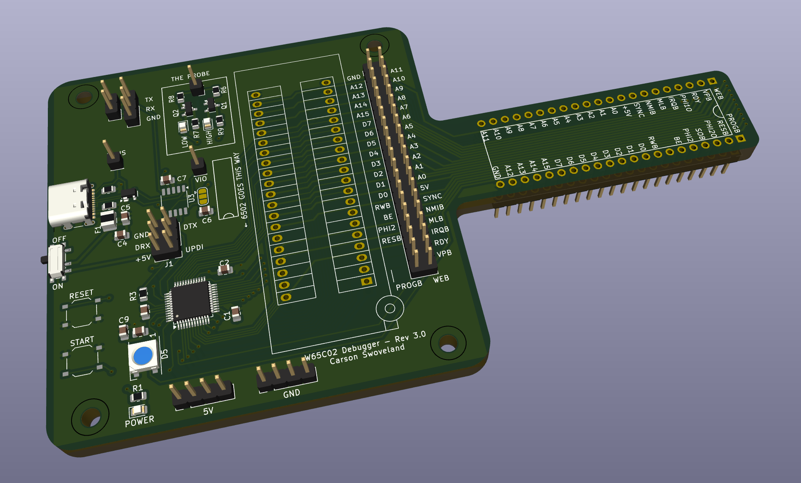
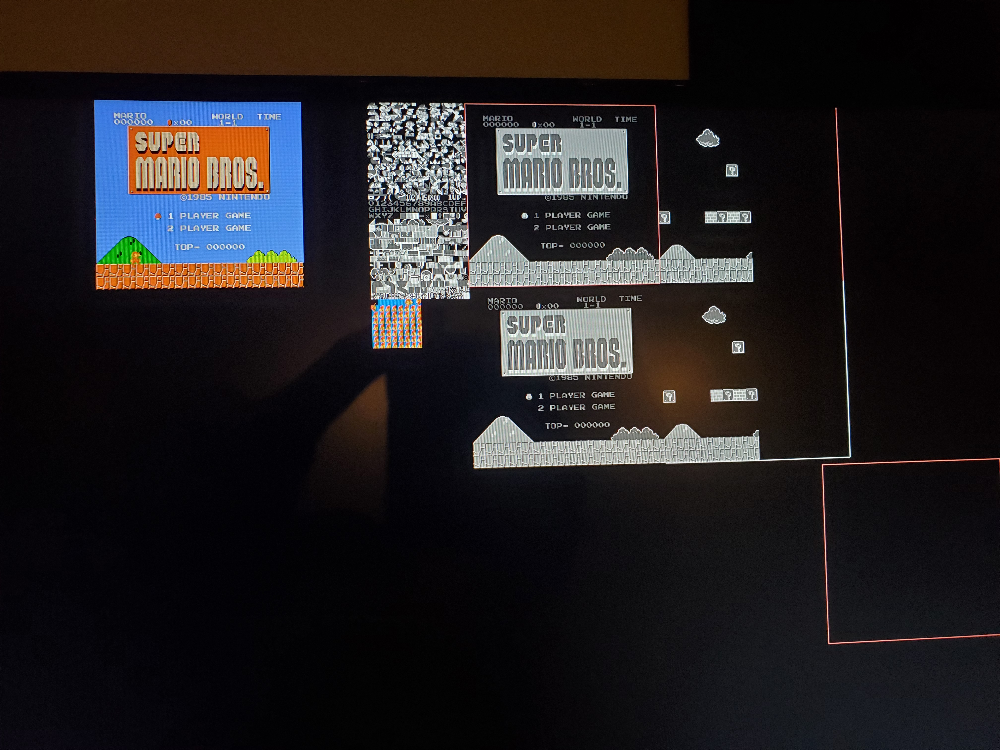

+++
date = "2022-08-13T00:00:00-05:00"
template = "page.html"
weight = 2
title = "BYOBC"
slug = "breadboard-computer"
draft = false

[extra]
time = "Ongoing"
page_identifier = "projects-breadboard-computer"
summary = "Teaching a course on homebrew computer design."

[extra.image]
path = "breadboard-computer/breadboard_computer.jpg"
alt = "breadboard_computer"
visible_in_main = true
+++

<iframe width="560" height="315" src="https://www.youtube.com/embed/36lvWIOPbbE" title="YouTube video player" frameborder="0" allow="accelerometer; autoplay; clipboard-write; encrypted-media; gyroscope; picture-in-picture; web-share" allowfullscreen></iframe>

### Overview

"Build Your Own Breadboard Computer" (BYOBC) is a course that I teach as part of CMU's Student College.
I am currently in my third semester teaching it.

In the course, students build a complete computer with RAM, ROM, a serial port, and a screen.
There is no expectation of prior electronics experience.

The course features
guest lectures from the CEO of Western Design Center <a href="https://en.wikipedia.org/wiki/Bill_Mensch">Bill Mensch</a>,
connections to modern computer design,
an entirely free-choice final project,
and the ability to keep the whole computer afterwards.

As part of developing the course I created a debugger board,
an ATMega4809-based PCB that simulates the entire 6502 processor,
while also providing EEPROM programming,
a serial connection, and a rudimentary logic analyzer affectionately called "The Probe."
It connects to a laptop over a USB-C cable to provide a GDB-like interface to students' computers.

### History

I've built about 3 of these computers before myself,
which is part of the reason why I decided to teach the class.
My most interesting attempt used a 6502 and about two dozen 74-series logic chips
to recreate the 2A03 processor used in the Nintendo Entertainment System.
By attaching a Raspberry Pi to the board, I could make it play Super Mario Bros, as shown below.

    
    

I'd like to revisit the breadboard NES project at some point,
now that I have a better idea of what's causing some of the timing problems.
Maybe I'll design it out beforehand and make a proper PCB for it.