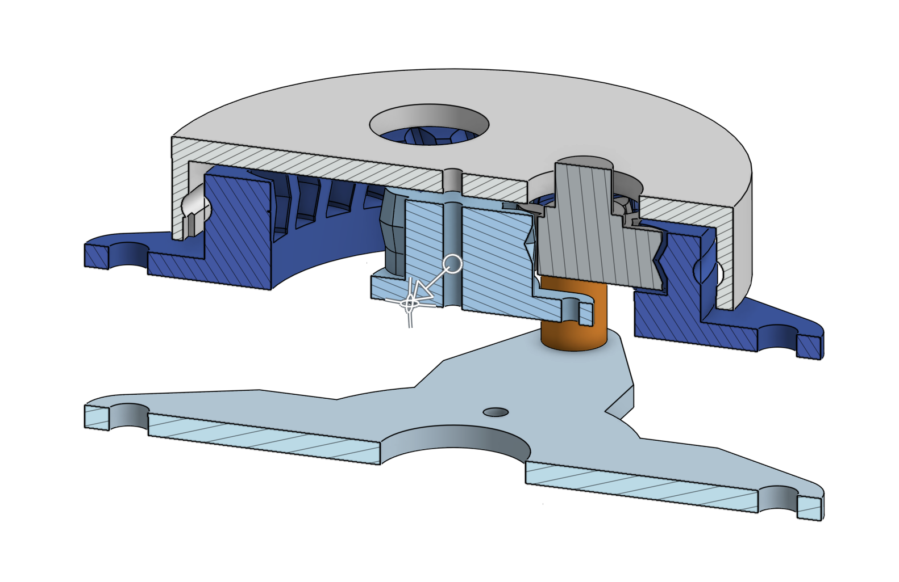
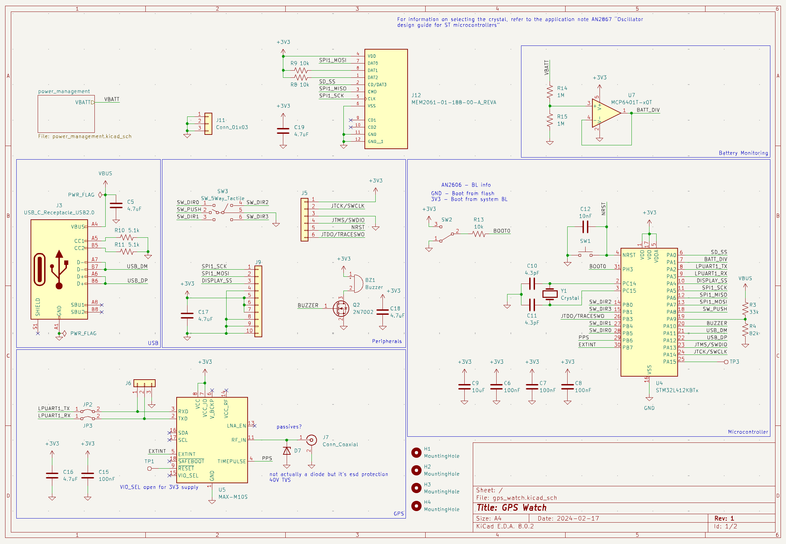

+++
date = "2024-08-13T00:00:00-05:00"
template = "page.html"
weight = 1
title = "Landhopper"
slug = "landhopper"
draft = false

[extra]
time = "Spring 2024"
page_identifier = "projects-robobuggy"
summary = "A self-charging, award-winning, GPS-enabled dumbwatch."

[extra.image]
path = "landhopper/on_wrist.png"
alt = "landhopper"
visible_in_main = true
+++

<iframe width="560" height="315" src="https://www.youtube.com/embed/pJQOzT7xFPs?si=kvnir8nJUfzGXw-r" title="YouTube video player" frameborder="0" allow="accelerometer; autoplay; clipboard-write; encrypted-media; gyroscope; picture-in-picture; web-share" referrerpolicy="strict-origin-when-cross-origin" allowfullscreen></iframe>

### Overview

Landhopper was my ECE capstone project that I created
with the help of Gary Bailey and Twain Byrnes.

It features:
- Solar-based self-charging capability
- Infinite battery life (when outdoors)
- 10m precision GPS tracking
- Offline map storage
- Path recording
- "Doom"

And for our efforts we placed first in the end-of-semester project competition.

### Design

I was responsible for the schematic-level PCB design and evaluating energy harvesting methods,
as well as writing a large portion of the firmware.

Our initial attempts at energy harvesting were mechanical, based on the swinging of the user's wrist.
I designed and 3D printed a 7:1 rotary gearbox that seemed promising.

However, we soon realized that solar power would be smaller, lighter, and more powerful.
Thus, we switched to a solar panel.

From there, I designed most of the system schematic.
The energy harvesting circuit uses
<a href="https://www.analog.com/en/products/adp5090.html">Analog Devices ADP5090</a>
to do MPPT.
The main microcontroller is an STM32L4,
connected to a variety of peripherals to do battery level sensing, input handling, display, etc.

Our Rust firmware leverages async/await to communicate with the Max M10S GPS unit
while also loading map images from an SD card, saving location history to a file,
and playing a little raycasted Doom-mockup that I put in at the last minute. :)

<video controls>
  <source src="notdoom.mp4" type="video/mp4">
</video>