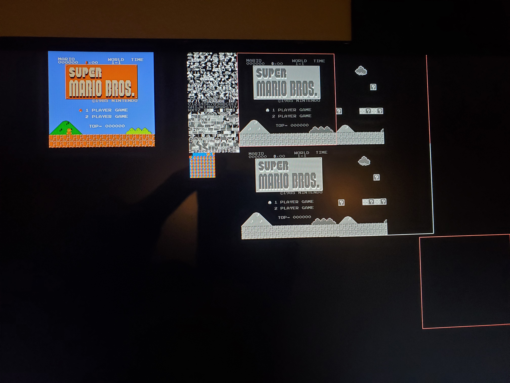

+++
date = "2022-08-13T00:00:00-05:00"
title = "6502 Computer"
description = "lorem ipsum dolor sit amet"
slug = "breadboard-computer"
draft = false

[taxonomies]
    categories = ["projects"]
    tags = ["zola"]

[extra]
    page_identifier = "projects-breadboard-computer"
+++

A custom computer using a 6502 processor on a breadboard.

<!-- more -->

<iframe width="560" height="315" src="https://www.youtube.com/embed/36lvWIOPbbE" title="YouTube video player" frameborder="0" allow="accelerometer; autoplay; clipboard-write; encrypted-media; gyroscope; picture-in-picture; web-share" allowfullscreen></iframe>

### Overview

This is a 'complete' computer with RAM, ROM, a serial port, and a screen.
In the video above I have programmed it to play Tic-Tac-Toe.

I have actually built a number of these computers before.
My previous attempt used a 6502 and about two dozen 74-series logic chips
to recreate the 2A03 processor used in the Nintendo Entertainment System.
By attaching a Raspberry Pi to the board, I could make it play Super Mario Bros, as shown below.

    
    

### Future Work

Next semester (Spring 2023) I am going to teach a class on how to build one of these computers
for people with no prior experience.

I'd like to revisit the breadboard NES project at some point,
now that I have a better idea of what's causing some of the timing problems.
Maybe I'll design it out beforehand and make a proper PCB for it.