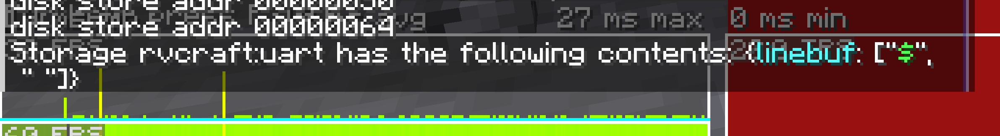
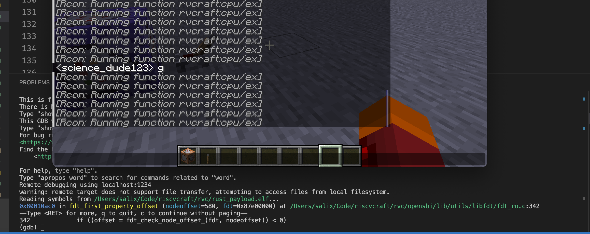

+++
date = "2024-08-01T00:00:00-05:00"
template = "page.html"
weight = 5
title = "RISC-VCraft"
slug = "riscvcraft"
draft = false

[extra]
time = "Ongoing"
summary = "Booting an OS where an OS should not be booted."

[extra.image]
path = "projects/robobuggy/rolls.jpg"
alt = "robobuggy"
visible_in_main = true
+++

If you've read the Wasmcraft post you know that Minecraft is Turing complete.

That's all well and good, but Minecraft is so 2012.
The future is in <i>RISC-V</i>.

Anyways, here's xv6's shell prompt:

RISC-Vcraft is an rv32sima emulator that runs entirely in Minecraft commands.
That means it can run real, actual operating systems (if you wait long enough).
The shell prompt above is a user space program, on a time-shared multitasking OS,
that has a root filesystem loaded from a real (virtual) disk,
that has all the coreutils you'd expect for a minimal teaching unixlike (echo, cat, ls, etc.).

The only caveat is that it takes 11 minutes to boot,
which I think is an acceptable cost if your only compute platform is Minecraft.

Also, debugging the emulator got kind of hard sometimes,
so to help myself out I wrote a custom gdb server so that I can use `gdb-multiarch`
to connect to and debug my datapack running in the game.

