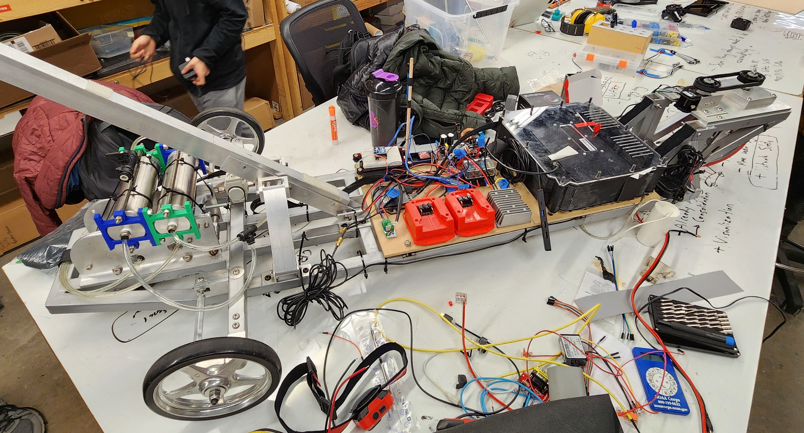

+++
date = "2022-08-13T00:00:00-05:00"
template = "page.html"
weight = 5
title = "Robobuggy"
description = "lorem ipsum dolor sit amet"
slug = "robobuggy"
draft = false

[extra]
time = "Ongoing"
page_identifier = "projects-robobuggy"
summary = "An automonous version of a long-standing CMU tradition."

[extra.image]
path = "projects/robobuggy/rolls.jpg"
alt = "robobuggy"
visible_in_main = true
+++

### What's a Buggy?

If you've never been to Carnegie Mellon University, you probably don't know what a "buggy" is.
Buggy is a CMU sport somewhat similar to a [soap box derby](https://en.wikipedia.org/wiki/Soap_Box_Derby).
Unlike a soap box derby, however, dozens of engineering students work year-round to make the buggies
as aerodynamic, lightweight, and _fast_ as possible.

### What's a RoboBuggy?

RoboBuggy is a spin-off project hosted by the Carnegie Mellon University Robotics Club.
The goal of RoboBuggy is to build a fully-autonomous buggy that can complete a race without human intervention.
The stretch goal, of course, is to beat a few human buggy teams in the process.

### Work

I implemented many of the firmware and electrical features, including:
- Serial communication hardware
  - Uses bidirectional level shifting and multiplexing
- Steering control
- Safety features, including an arming sequence and a dead man's switch
- Radio control reception and decoding
- Brake solenoid control board design and assembly
- Logging radio for interactive debugging